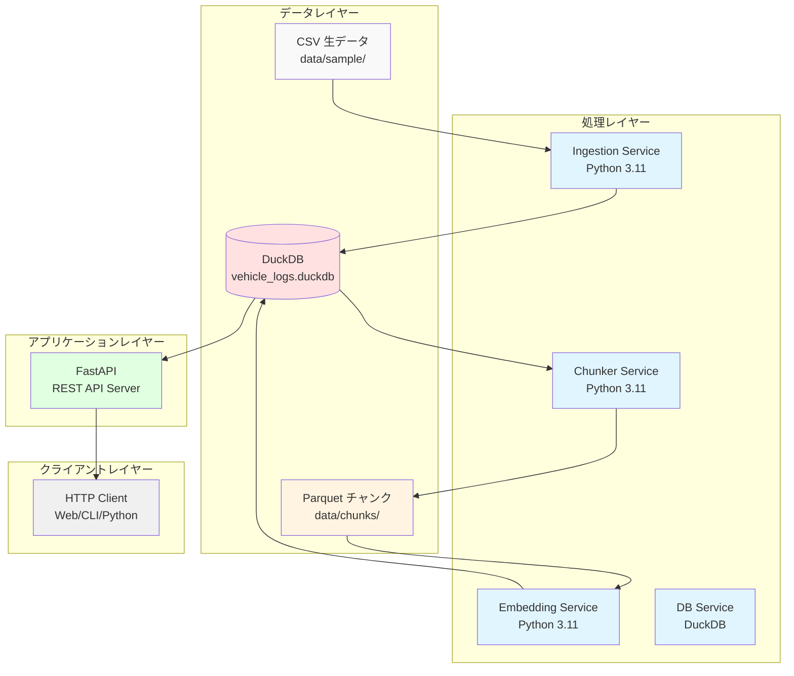

# システムアーキテクチャ (System Architecture)

Vehicle Log System の技術アーキテクチャとコンポーネント設計について説明します。

## アーキテクチャ概要

### システム構成図



---

## コンポーネント詳細

### 1. Ingestion Service

**目的:** CSV データを DuckDB に直接ロード

**技術スタック:**
- Python 3.11
- Pandas (データ処理)
- DuckDB (データベースアクセス)

**主要機能:**
- CSV ファイルの読み込み
- タイムスタンプの正規化
- DuckDB テーブルへのロード
  - `can_log` テーブル
  - `gps_log` テーブル

**入力:**
- `data/sample/` - CSV ファイル群

**出力:**
- DuckDB テーブル（`data/db/vehicle_logs.duckdb`）

**実行方法:**
```bash
docker compose run ingestion python prepare_data.py
```

**ステータス:** ✅ 実装済み

---

### 2. Chunker Service

**目的:** DuckDB から時系列データを読み取り、固定長の時間窓で分割

**技術スタック:**
- Python 3.11
- Pandas
- DuckDB
- PyArrow (Parquet 出力)

**主要機能:**
- DuckDB からデータ読み込み
- 60秒単位のチャンク分割
- GPS + CAN の特徴量抽出
  - 速度統計（平均、最大、最小）
  - CAN 信号統計
- Parquet 形式での保存

**アルゴリズム:**
```python
# 擬似コード
CHUNK_LEN = 60  # 秒
# DuckDB から GPS + CAN データを読み込み
# タイムスタンプベースでチャンク分割
# 各チャンクの特徴量を計算
# Parquet 形式で保存
```

**入力:**
- DuckDB テーブル (`can_log`, `gps_log`)

**出力:**
- `data/chunks/chunk_0.parquet`
- `data/chunks/chunk_1.parquet`
- ...

**実行方法:**
```bash
docker compose run chunker python make_chunks.py
```

**実装ファイル:**
- `chunking/make_chunks.py`
- `chunking/download_sample_data.py`

**ステータス:** ✅ 実装済み

---

### 3. Embedding Service

**目的:** 各チャンクから特徴量を抽出し、ベクトル化して DuckDB に保存

**技術スタック:**
- Python 3.11
- sentence-transformers (ベクトル化)
- DuckDB (ベクトル保存)
- Pandas (データ処理)

**使用モデル:**
- `all-MiniLM-L6-v2` (384次元ベクトル)

**処理フロー:**
1. Parquet チャンクファイルを読み込み
2. 特徴量をテキスト表現に変換
3. sentence-transformers でベクトル化
4. DuckDB `embeddings` テーブルに保存

**入力:**
- `data/chunks/chunk_*.parquet`

**出力:**
- DuckDB `embeddings` テーブル

**実行方法:**
```bash
docker compose run embedding python embed_chunks.py
```

**実装ファイル:**
- `embedding/embed_chunks.py`

**ステータス:** ✅ 実装済み

---

### 4. Database Service (DuckDB)

**目的:** 構造化データの永続化とクエリ処理

**技術スタック:**
- DuckDB (組み込み分析データベース)
- Python 3.11

**DuckDB の特徴:**
- 軽量で高速な分析処理
- PostgreSQL 互換の SQL
- Parquet ファイルの直接クエリ対応
- OLAP (分析処理) に最適化

**テーブル設計:**

```sql
-- CAN bus ログ
CREATE TABLE can_log (
    ts TIMESTAMP,           -- タイムスタンプ
    vehicle_id VARCHAR,     -- 車両ID
    signal VARCHAR,         -- シグナル名
    value DOUBLE           -- 値
);

-- GPS ログ
CREATE TABLE gps_log (
    ts TIMESTAMP,           -- タイムスタンプ
    vehicle_id VARCHAR,     -- 車両ID
    lat DOUBLE,            -- 緯度
    lon DOUBLE,            -- 経度
    speed DOUBLE,          -- 速度 (km/h)
    heading DOUBLE         -- 方位角 (度)
);

-- ベクトル埋め込みテーブル
CREATE TABLE embeddings (
    chunk_id INTEGER,       -- チャンク ID
    embedding DOUBLE[384]   -- ベクトル (384次元)
);

-- インデックス
CREATE INDEX idx_can_ts ON can_log(ts);
CREATE INDEX idx_gps_ts ON gps_log(ts);
```

**入力:**
- Ingestion からの生データ
- Embedding からのベクトルデータ

**データベースファイル:**
- `data/db/vehicle_logs.duckdb`

**実行方法:**
```bash
docker compose run db
```

**実装ファイル:**
- `db/run_duckdb.py`

**特徴:**
- ファイルベースの組み込みデータベース
- 全サービスがボリュームマウント (`./data`) 経由でアクセス
- サーバープロセス不要

---

### 5. API Service (FastAPI)

**目的:** REST API によるデータアクセス層の提供

**技術スタック:**
- FastAPI (高速な非同期Webフレームワーク)
- Uvicorn (ASGI サーバー)
- Pydantic (データバリデーション)
- DuckDB (データベースアクセス)

**エンドポイント設計:**

| メソッド | パス | 説明 |
|---------|------|------|
| GET | `/health` | ヘルスチェック |
| GET | `/chunks` | チャンクファイル一覧 |
| GET | `/chunk/{cid}` | 特定チャンクの先頭50行 |
| GET | `/search?q=...&top_k=5` | ベクトル類似検索 |
| GET | `/logs?table=gps_log` | CAN/GPS ログ直接クエリ |

**レスポンス形式:**
```json
{
  "status": "success",
  "data": [...],
  "count": 100,
  "timestamp": "2025-12-29T00:00:00Z"
}
```

**入力:**
- DuckDB クエリ結果
- Parquet ファイル（直接読み込み）

**ポート:**
- `8000` (HTTP)

**実行方法:**
```bash
docker compose up api
```

**アクセス:**
```bash
# ヘルスチェック
curl http://localhost:8000/health

# チャンク一覧
curl http://localhost:8000/chunks

# 類似検索
curl "http://localhost:8000/search?q=acceleration&top_k=5"

# Swagger UI
open http://localhost:8000/docs
```

**実装ファイル:**
- `api/main.py`

**ステータス:** ✅ 実装済み

---

## データフロー詳細

### ファイルフォーマット

すべての中間データは **Apache Parquet** 形式:

**Parquet の利点:**
- 列指向ストレージ → 効率的な圧縮
- スキーマ情報の埋め込み
- 高速な列アクセス
- Pandas/PyArrow との互換性

**タイムスタンプの扱い:**
- 内部表現: `int64` (ナノ秒)
- 処理時: 秒単位に変換 (`ts / 1e9`)
- DuckDB: `TIMESTAMP` 型

---

## Docker 構成

### Dockerfile 設計方針

各サービスは独立した Dockerfile を持つ:

**ベースイメージ:**
```dockerfile
FROM python:3.11-slim
```

**共通パターン:**
1. 作業ディレクトリ設定
2. 依存関係インストール
3. アプリケーションコード配置
4. 実行コマンド指定

**例: Chunker Service**
```dockerfile
FROM python:3.11-slim

WORKDIR /app

COPY requirements.txt .
RUN pip install --no-cache-dir -r requirements.txt

COPY . .

CMD ["python", "make_chunks.py"]
```

### Docker Compose オーケストレーション

**サービス実行順序:**
```
db → ingestion → chunker → embedding → api
```

**実際の構成:**
- すべてのサービスが独立して実行可能
- 各サービスは `docker compose run [service] python [script]` で実行
- API のみポート公開 (`8000:8000`)

**ボリュームマウント戦略:**
- ホスト側の `./data` を各コンテナの `/app/data` にマウント
- データの永続化と共有を実現
- DuckDB ファイル (`data/db/vehicle_logs.duckdb`) をすべてのサービスが共有

**ネットワーク:**
- デフォルトブリッジネットワーク
- サービス名で相互通信可能（ただし現在は DuckDB ファイル経由のデータ共有のみ）

---

## セキュリティ考慮事項

### 現在の実装

- ローカル開発環境向け
- 認証・認可なし
- ポート 8000 のみ公開

### 本番環境への移行時の推奨事項

1. **認証:**
   - OAuth 2.0 / JWT トークン
   - API キー認証

2. **通信:**
   - HTTPS/TLS 暗号化
   - リバースプロキシ (Nginx)

3. **データベース:**
   - アクセス制御
   - パスワード保護

4. **環境変数:**
   - `.env` ファイルで機密情報管理
   - Docker Secrets の活用

---

## パフォーマンス最適化

### 現在の最適化

- **Parquet 形式**: 圧縮率が高く、読み込みが高速
- **DuckDB**: OLAP クエリに最適化
- **Pandas**: ベクトル化された処理

### 将来の最適化案

1. **並列処理:**
   - マルチプロセス/マルチスレッド
   - Dask/Ray による分散処理

2. **キャッシング:**
   - Redis でクエリ結果をキャッシュ
   - API レベルでの ETag 対応

3. **インデックス:**
   - タイムスタンプインデックスの最適化
   - 複合インデックスの活用

4. **ストリーミング:**
   - Apache Kafka でリアルタイム処理
   - ストリーミングチャンク化

---

## 拡張性

### 水平スケーリング

- **API サーバー**: ロードバランサーで複数インスタンス
- **処理サービス**: Kubernetes での並列実行

### 垂直スケーリング

- DuckDB のメモリ割り当て増加
- コンテナリソース制限の調整

---

## 監視とロギング

### 推奨ツール

- **ログ集約**: ELK Stack (Elasticsearch, Logstash, Kibana)
- **メトリクス**: Prometheus + Grafana
- **トレーシング**: Jaeger/OpenTelemetry

### ログ出力方針

- 構造化ログ (JSON 形式)
- タイムスタンプ付き
- ログレベル: DEBUG, INFO, WARNING, ERROR

---

## テスト戦略

### 現在の状態

- 手動テストのみ
- Docker Compose での統合テスト

### 推奨テスト構成

1. **ユニットテスト:**
   - pytest
   - 各モジュールの関数テスト

2. **統合テスト:**
   - Docker Compose でのエンドツーエンドテスト
   - API エンドポイントテスト

3. **パフォーマンステスト:**
   - 大量データでの処理時間計測
   - メモリ使用量の監視

---

## トラブルシューティング

### デバッグ方法

**ログ確認:**
```bash
docker compose logs -f [service_name]
```

**コンテナ内での確認:**
```bash
docker compose exec [service_name] bash
```

**ボリュームの確認:**
```bash
docker volume ls
docker volume inspect [volume_name]
```

### よくある問題

| 問題 | 原因 | 解決方法 |
|------|------|---------|
| コンテナが起動しない | Dockerfile のビルドエラー | `docker compose build --no-cache` |
| ボリュームが空 | マウントパスの誤り | `docker-compose.yml` を確認 |
| API が応答しない | DB サービスが起動していない | 依存関係を確認 |

---

## 参考資料

### 使用技術のドキュメント

- [FastAPI Documentation](https://fastapi.tiangolo.com/)
- [DuckDB Documentation](https://duckdb.org/docs/)
- [Pandas Documentation](https://pandas.pydata.org/docs/)
- [Docker Compose Documentation](https://docs.docker.com/compose/)
- [Apache Parquet Format](https://parquet.apache.org/docs/)

### 関連プロジェクト

- CAN bus デコーディング: `python-can`
- GPS 処理: `gpxpy`, `geopy`
- 時系列分析: `tslearn`, `tsfresh`
