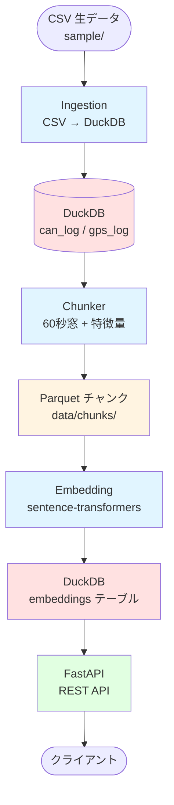
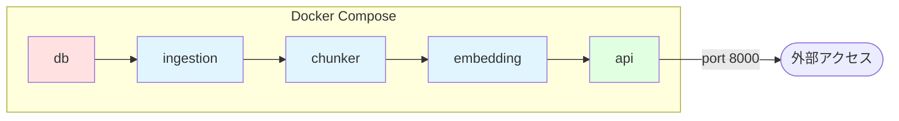
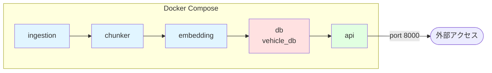

# データフロー図 (Data Flow Diagram)

Vehicle Log System の処理パイプラインの全体像を示します。

## 全体フロー概要



## 各処理ステージの詳細

### 1. Ingestion（データ取り込み）

**入力:**
- `data/sample/` 内の CSV ファイル
  - CAN bus ログ
  - GPS データ
  - テレメトリデータ

**処理:**
- CSV ファイルを読み込み
- タイムスタンプの正規化
- DuckDB テーブルへの直接ロード
  - `can_log` テーブル
  - `gps_log` テーブル

**出力:**
- DuckDB テーブル (`data/db/vehicle_logs.duckdb`)

**実装:** `ingestion/prepare_data.py`

**ステータス:** ✅ 実装済み

---

### 2. Chunking（チャンク化）

**入力:**
- DuckDB の `can_log` / `gps_log` テーブル

**処理:**
- 時系列データを固定長の時間窓で分割（デフォルト: 60秒）
- GPS + CAN のチャンク単位の特徴量を抽出
  - 速度統計（平均、最大、最小）
  - CAN 信号統計
- Parquet 形式で保存

**出力:**
- `data/chunks/chunk_0.parquet`
- `data/chunks/chunk_1.parquet`
- `data/chunks/chunk_N.parquet`

**実装:** `chunking/make_chunks.py`

**主要パラメータ:**
- `CHUNK_LEN = 60` (秒)

**ステータス:** ✅ 実装済み

---

### 3. Embedding（ベクトル化）

**入力:**
- `data/chunks/` 内の各チャンクファイル（Parquet）

**処理:**
- 各チャンクから特徴量をテキスト表現に変換
- sentence-transformers (`all-MiniLM-L6-v2`) でベクトル化（384次元）
- ベクトルを DuckDB に保存

**出力:**
- DuckDB `embeddings` テーブル

**実装:** `embedding/embed_chunks.py`

**モデル:** `all-MiniLM-L6-v2` (384次元)

**ステータス:** ✅ 実装済み

---

### 4. Database (DuckDB)

**入力:**
- Ingestion からの生データ
- Embedding からのベクトルデータ

**テーブル構造:**

```sql
-- CAN ログテーブル
CREATE TABLE can_log (
    ts TIMESTAMP,
    vehicle_id VARCHAR,
    signal VARCHAR,
    value DOUBLE
);

-- GPS ログテーブル
CREATE TABLE gps_log (
    ts TIMESTAMP,
    vehicle_id VARCHAR,
    lat DOUBLE,
    lon DOUBLE,
    speed DOUBLE,
    heading DOUBLE
);

-- 埋め込みベクトルテーブル
CREATE TABLE embeddings (
    chunk_id INTEGER,
    embedding DOUBLE[384]
);
```

**データベースファイル:**
- `data/db/vehicle_logs.duckdb`

**実装:** `db/run_duckdb.py`

**特徴:**
- ファイルベースの組み込みデータベース
- 全サービスがボリュームマウント経由でアクセス
- OLAP（分析処理）に最適化

---

### 5. API (FastAPI)

**入力:**
- DuckDB からのクエリ結果
- チャンクファイルの直接読み込み

**主要エンドポイント:**

| メソッド | パス | 説明 |
|---------|------|------|
| GET | `/health` | ヘルスチェック |
| GET | `/chunks` | チャンクファイル一覧 |
| GET | `/chunk/{cid}` | 特定チャンクの先頭50行 |
| GET | `/search?q=...&top_k=5` | ベクトル類似検索 |
| GET | `/logs?table=gps_log` | CAN/GPS ログ直接クエリ |

**実装:** `api/main.py`

**アクセス:**
- `http://localhost:8000`
- Swagger UI: `http://localhost:8000/docs`

**ステータス:** ✅ 実装済み

---

## Docker サービス構成



### サービス実行順序

1. **db**: DuckDB スキーマ初期化
2. **ingestion**: CSV → DuckDB ロード
3. **chunker**: チャンク化 + 特徴量抽出
4. **embedding**: ベクトル化 → DuckDB 保存
5. **api**: API サーバー起動

### ボリュームマウント

すべてのサービスが `./data` を共有:
- `./data/sample/` - サンプル CSV
- `./data/db/` - DuckDB ファイル
- `./data/chunks/` - チャンク Parquet

---

## 実行フロー

### 初回セットアップ

```bash
# 1. サンプルデータのダウンロード
docker compose run chunker python download_sample_data.py

# 2. DB スキーマ初期化
docker compose run db

# 3. CSV を DuckDB にロード
docker compose run ingestion python prepare_data.py

# 4. チャンク化処理
docker compose run chunker python make_chunks.py

# 5. ベクトル化
docker compose run embedding python embed_chunks.py

# 6. API サーバーの起動
docker compose up api
```

### API アクセス例

```bash
# ヘルスチェック
curl http://localhost:8000/health

# チャンク一覧
curl http://localhost:8000/chunks

# 類似検索
curl http://localhost:8000/search?q=acceleration&top_k=5
```

---

## データフォーマット

### Parquet ファイル構造

チャンクデータは Apache Parquet 形式:

**利点:**
- 列指向ストレージで効率的な圧縮
- スキーマ情報の保持
- 高速な読み込み性能
- Pandas/PyArrow との互換性

**チャンク特徴量:**
- `chunk_id`: チャンク番号
- `start_time`, `end_time`: 時間窓
- `avg_speed`, `max_speed`, `min_speed`: 速度統計
- CAN 信号の統計値

---

## トラブルシューティング

### よくある問題

| 問題 | 原因 | 解決方法 |
|------|------|---------|
| サンプルデータが見つからない | データ未ダウンロード | `docker compose run chunker python download_sample_data.py` |
| DuckDB にテーブルがない | スキーマ未初期化 | `docker compose run db` |
| チャンクが空 | データ未ロード | `docker compose run ingestion python prepare_data.py` 後にチャンク化 |
| API が起動しない | DB サービス未起動 | `docker compose logs api` でエラー確認 |
| 検索で 503 エラー | ベクトル未生成 | `docker compose run embedding python embed_chunks.py` |

---

## 今後の拡張予定

### 機能追加

- [ ] CAN デコーダーの実装（DBC ファイル対応）
- [ ] GPS 補間処理（Kalman Filter）
- [ ] リアルタイム処理対応
- [ ] Web UI ダッシュボード
- [ ] データエクスポート機能

### 最適化

- [ ] 並列処理の導入
- [ ] キャッシング戦略
- [ ] インデックス最適化
- [ ] バッチ処理の効率化
- 特徴量をベクトル化
- 類似検索用のインデックス構築

**出力:**
- `embeddings/` - ベクトルデータとインデックス

**ステータス:** 🚧 準備中

**将来の拡張:**
- FFT による周波数成分解析
- 統計的特徴量（平均、分散、最大・最小値）
- 運転シーン分類ラベル

---

### 4. Database (DuckDB)

**入力:**
- `embeddings/` - ベクトルデータ

**処理:**
- DuckDB データベースへのデータ投入
- テーブル構造の初期化
- インデックスの構築

**テーブル構造:**

```sql
-- CAN ログテーブル
CREATE TABLE can_log (
    ts TIMESTAMP,
    vehicle_id VARCHAR,
    signal VARCHAR,
    value DOUBLE
);

-- GPS ログテーブル
CREATE TABLE gps_log (
    ts TIMESTAMP,
    vehicle_id VARCHAR,
    lat DOUBLE,
    lon DOUBLE,
    speed DOUBLE,
    heading DOUBLE
);
```

**データベースファイル:**
- `data/db/vehicle_logs.duckdb`

**実装:** `db/run_duckdb.py`

---

### 5. API (FastAPI)

**入力:**
- DuckDB からのクエリ結果
- チャンクファイルの直接読み込み

**処理:**
- REST API エンドポイントの提供
- クエリパラメータの処理
- レスポンスのJSON変換

**主要エンドポイント:**
- `GET /` - ヘルスチェック
- `GET /chunks` - チャンク一覧
- `GET /chunks/{chunk_id}` - 特定チャンクのデータ取得
- その他（将来追加予定）

**実装:** `api/main.py`

**アクセス:**
- `http://localhost:8000`

---

## Docker サービス構成



### サービス間の依存関係

- **ingestion** → **chunker**: データ統合後にチャンク化
- **chunker** → **embedding**: チャンク生成後にベクトル化
- **embedding** → **db**: ベクトル化後にDB保存
- **db** → **api**: DBからデータ取得してAPI提供

### ボリュームマウント

各サービスは Docker ボリュームを通じてデータを共有:

- `./data` - 永続データストレージ
- `./prepared` - 統合データ
- `./chunks` - チャンクデータ
- `./embeddings` - ベクトルデータ

---

## 実行フロー

### 初回セットアップ

```bash
# 1. サンプルデータのダウンロード
docker compose run chunker python download_sample_data.py

# 2. チャンク化処理
docker compose run chunker python make_chunks.py

# 3. 全サービスの起動
docker compose up
```

### データ処理フロー（将来）

```bash
# 1. データ統合
docker compose run ingestion python prepare_data.py

# 2. チャンク化
docker compose run chunker python make_chunks.py

# 3. ベクトル化
docker compose run embedding python create_embeddings.py

# 4. API起動
docker compose up api db
```

---

## データフォーマット

### Parquet ファイル構造

すべての中間データは Apache Parquet 形式で保存されます:

**利点:**
- 列指向ストレージで効率的な圧縮
- スキーマ情報の保持
- 高速な読み込み性能
- Pandas/PyArrow との互換性

**タイムスタンプ:**
- 内部: int64 (ナノ秒)
- 処理時: 秒単位に変換

---

## トラブルシューティング

### よくある問題

| 問題 | 原因 | 解決方法 |
|------|------|---------|
| チャンクが生成されない | サンプルデータが未ダウンロード | `docker compose run chunker python download_sample_data.py` |
| API が起動しない | DB サービスが起動していない | `docker compose up db` を先に実行 |
| パスが見つからない | ボリュームマウントの問題 | `docker-compose.yml` のボリューム設定を確認 |

---

## 今後の拡張予定

### 機能追加

- [ ] CAN デコーダーの実装
- [ ] GPS 補間処理（Kalman Filter）
- [ ] リアルタイム処理対応
- [ ] Web UI ダッシュボード
- [ ] データエクスポート機能

### 最適化

- [ ] 並列処理の導入
- [ ] キャッシング戦略
- [ ] インデックス最適化
